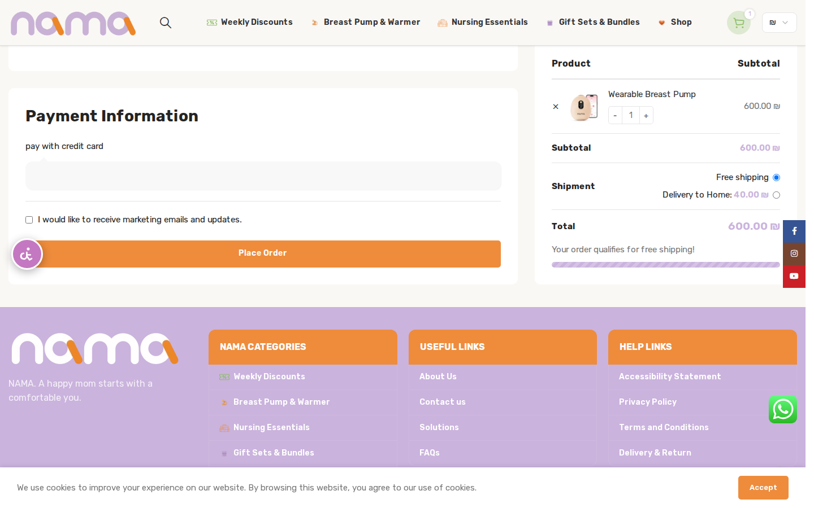
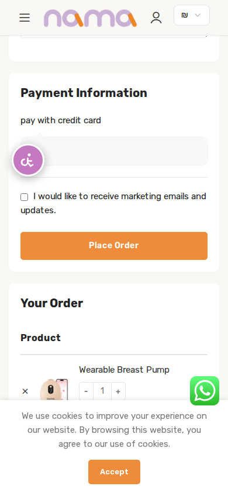
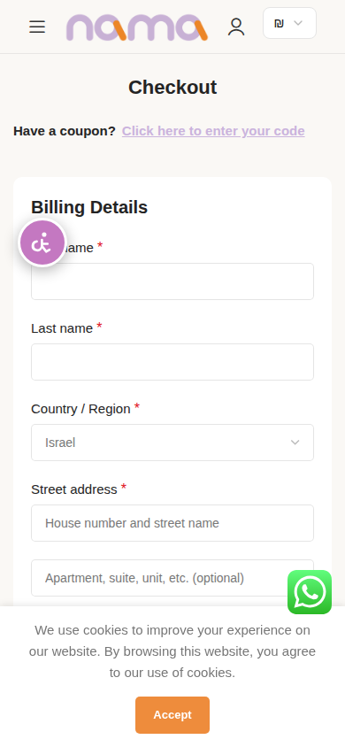
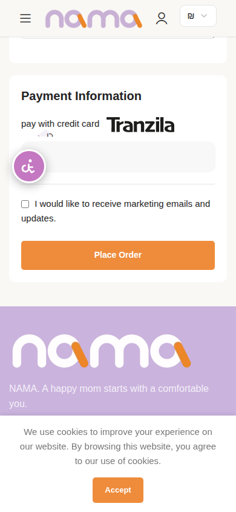
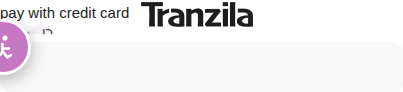
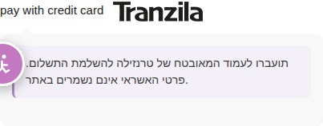

# מה שנמצא בדפדפן אמיתי — 30 באוגוסט 2026

עד כה כל המדידות נעשו ב-HTTP בלבד. כאן נכנסתי לאתר **בדפדפן Chromium אמיתי**,
עם סשן עגלה חי, ובדקתי מה הלקוח באמת רואה.

**לא בוצעה שום הזמנה ולא נשלח תשלום.** מוצר הוסף לעגלה, וזהו.

---

## 0. איך זה נפתר טכנית

במסמך 10 §7 כתבתי שדפדפן אינו אפשרי כאן, כי Chromium נכשל מול שרת ה-proxy של
הסביבה — לכל אתר, לא רק לנמה. זה עדיין נכון, אבל **מצאתי דרך לעקוף**.

Node **כן** מצליח לפתוח מנהרת CONNECT דרך אותו proxy. לכן בניתי גשר:

```
Chromium  ──►  MITM מקומי (127.0.0.1:8888)  ──►  מנהרת CONNECT של Node  ──►  האתר
```

הגשר (`tools/mitm-bridge.mjs`) מסיים TLS מקומית עם תעודה עצמית, ומביא את התוכן
דרך Node. Chromium רץ עם `--ignore-certificate-errors` ומדבר איתו רגיל.

> **מה זה אומר על המספרים:** זמני התגובה בדפדפן **אינם אמינים** — הגשר מוסיף
> תקורה. לכן כל מדידות הזמן במסמכים 9 ו-10 נשארות מקור האמת. מה שכן אמין כאן:
> **מה שנראה על המסך, מבנה העמוד, שגיאות JS, ומספר הבקשות.**

---

## 1. 🔴 תיבת התשלום ריקה

זה הממצא החמור ביותר במסמך הזה.



מה שנמדד ב-DOM:

```json
{
  "box":  { "height": 50, "display": "block", "text": "" },
  "logo": { "display": "none", "height": 0 },
  "trust": { "sslText": false, "redirectNotice": false, "termsCheckbox": false }
}
```

**`text` ריק. גובה 50 פיקסלים. מלבן אפור ריק.**

מה שהלקוח רואה ברגע התשלום:
1. כותרת "Payment Information"
2. הטקסט האפור "pay with credit card"
3. **מלבן אפור ריק**
4. תיבת סימון לניוזלטר שיווקי
5. כפתור כתום "Place Order"

ומה שהוא **לא** רואה, כי נמדד שאינו קיים בעמוד:
- שום סמל של כרטיס אשראי (`cardIcons` — היחיד שקיים מוסתר)
- שום מילה על אבטחה או הצפנה (`sslText: false`)
- **שום הודעה שהוא עומד לעבור לאתר חיצוני** (`redirectNotice: false`)
- שום תיבת אישור תנאים (`termsCheckbox: false`)

### הלוגו מוסתר בכוונה — על ידי התוסף עצמו
בתוך תיבת התשלום, תוסף השער מזריק:

```html
<style> label[for="payment_method_tranzila"] > img{display: none !important;}</style>
```

כלומר **סמל אמצעי התשלום היחיד בעמוד מוסתר**, על ידי הקוד של השער עצמו.

### למה זה משנה
לרכישה של ‎600 ₪, זו בקשה למסור פרטי אשראי בלי שום סימן אמון, ובלי לומר ללקוח
שהוא עומד להיזרק לאתר אחר. כשהוא כן נזרק לעמוד של טרנזילה — שנראה אחרת לגמרי
מהאתר — הוא לא ציפה לזה.

**זה מתאים בדיוק לתמונה של 867 הזמנות שנוצרו ולא שולמו.**

---

## 2. 🔴 בנייד — הסכום מופיע *אחרי* כפתור ההזמנה



נמדד ב-390×844 (אייפון):

| רכיב | מיקום אנכי |
|---|---|
| תיבת התשלום | y = 1,583 |
| **כפתור "Place Order"** | **y = 1,787** |
| **שורת הסכום לתשלום** | **y = 2,258** |

**הלקוח מתבקש לאשר הזמנה 471 פיקסלים לפני שהוא רואה כמה הוא משלם.**

בדסקטופ יש שתי עמודות והסיכום מופיע מימין, אז הבעיה לא קיימת. בנייד עמודת
הסיכום של Elementor נערמת **מתחת** לעמודת הטופס. רוב הקונים בחנות כזו הם בנייד.

---

## 3. 🟠 אין עברית

בורר השפה מציע **שתי שפות בלבד**:

```
English · العربية
```

חנות ישראלית, מוכרת ב-₪, שולחת בישראל ("Delivery to Home"), סולקת דרך טרנזילה —
**והצ׳קאאוט באנגלית**: "Billing Details", "Street address", "Town / City",
"Place Order".

לא ידוע לי אם זו החלטה עסקית מודעת (קהל דובר ערבית ואנגלית) או פער שנוצר מעצמו.
**אם קהל היעד כולל דוברי עברית — זה שווה בדיקה לפני כל תיקון טכני אחר כאן.**

---

## 4. 🟠 פיקסל פייסבוק זורק שגיאה אמיתית

בקונסולה, בכל עמוד:

```
[SmartSetup] Rule processing issues
ed=[{"category":"no_values","key":"price"},
    {"category":"no_values","key":"page_title"},
    {"category":"no_values","key":"image_url"},
    {"category":"no_values","key":"all_entity_images"},
    {"category":"no_values","key":"page_description"},
    {"category":"no_values","key":"page_bread_crumbs"}]
```

הפיקסל לא מצליח לחלץ **מחיר**, כותרת, תמונה ותיאור. כלומר **מדידת ההמרות של
פייסבוק חלקית** — אירועים נשלחים בלי ערך כספי. אם מפרסמים בפייסבוק, ה-ROAS
שנמדד שם אינו אמין.

---

## 5. 🟢 מה שדווקא תקין

בדיקה בדפדפן אמיתי לא מצאה שום שבר פונקציונלי:

- **אפס שגיאות JavaScript** בכל חמשת העמודים שנבדקו. הצ׳קאאוט רץ נקי.
- **CLS 0.014–0.018** — יציבות ויזואלית מצוינת (הסף הטוב הוא מתחת ל-0.1).
- הוספה לעגלה עובדת, מונה העגלה מתעדכן ל-1, המשלוח מחושב, הסכום נכון.
- ווידג׳ט הנגישות נטען ומוצג.
- שגיאות `analytics.google.com` שנראו הן ביטול beacon בזמן ניווט — התנהגות רגילה.

**הבעיה בצ׳קאאוט אינה תקלה. היא איטיות ואמון.**

---

## 6. מספר הבקשות — עכשיו נמדד בדפדפן

| עמוד | סה"כ בקשות | גיליונות סגנון | סקריפטים |
|---|---|---|---|
| דף הבית | **222** | 96 | 82 |
| עמוד מוצר | **216** | 99 | 90 |
| אחרי הוספה לעגלה | **251** | 104 | 100 |
| עגלה | **216** | 91 | 90 |
| **תשלום** | **187** | 78 | 83 |

מאשש את מסמך 9 §4: המיזעור של WP Rocket כבוי לגמרי.

> **הערה על החסימה:** במהלך הבדיקה בדפדפן האתר התחיל להחזיר timeout, בעוד
> ש-curl המשיך לעבוד. הסיבה: כל טעינת עמוד בדפדפן היא ‎~200 בקשות בבת אחת,
> וזה מפעיל בדיוק את מגביל הקצב של LiteSpeed מ-`docs/09` §7.
> **זו הדגמה חיה של הממצא הזה** — ושל מה שקורה לגולש אמיתי בחיבור מהיר.

---

## 7. התיקון — נכתב, נבדק ואומת בדפדפן

התיקונים נוספו ל-`tools/nama-speed.php` (מתג `checkout_ux`). **כל כלל נבדק
בדפדפן מול האתר החי לפני שנכתב לקובץ.**

| # | מה תוקן | לפני | אחרי | אומת ויזואלית |
|---|---|---|---|---|
| 1 | סדר בנייד | כפתור y=1,787 · סכום y=2,258 | **סכום y=583 · כפתור y=2,311** | ✅ צילום מסך |
| 2 | לוגו טרנזילה | `display: none`, גובה 0 | **`inline-block`, גובה 25px** | ✅ צילום מסך |
| 3 | בועת וואטסאפ | `display: block` | **`display: none`** | ✅ צילום מסך |
| 4 | הודעת הפניה | תיבה ריקה, גובה 50px | **הודעה מוצגת, תיבה 116px** | ✅ צילום מסך |

 

### שני לקחים — שניהם מכישלונות שהדפדפן חשף

**א. `!important` לא תמיד מנצח.**
הניסיון הראשון להחזיר את הלוגו נכשל. הסיבה: תוסף השער מזריק את הסגנון שלו
**בתוך גוף העמוד**, אחרי כל מה שב-`<head>`. כששני כללים זהים בספציפיות, המאוחר
מנצח — גם אם לשניהם יש `!important`. התיקון: להעלות ספציפיות עם
`li.wc_payment_method` בתחילת הסלקטור.

**ב. `::before` לא הספיק — והבדיקה הצילה אותי מלשלוח תיקון שבור.**
הוספתי את הודעת ההפניה עם פסאודו-אלמנט. הדפדפן דיווח שהכלל **מחושב נכון**:

```json
{ "beforeContent": "\"תועברו לעמוד המאובטח…\"", "beforeDisplay": "block", "beforeH": "24px" }
```

אבל **בצילום המסך ההודעה לא נראתה.** הסיבה: התבנית קובעת ל-`.payment_box` גובה
קבוע — `"boxHeightCss": "50px"`.

לו הייתי בודק רק את ה-DOM, הייתי מדווח על תיקון שעובד. **הוא לא עבד.**
לכן ההודעה עברה מ-CSS ל-PHP: מסנן `woocommerce_gateway_description` שמכניס
אלמנט אמיתי, ובנוסף כלל שמשחרר את הגובה הקבוע. אלמנט אמיתי לא נעלם בגלל
`height: 50px` — הוא דוחף את התיבה.

הגרסה ב-PHP נבדקה בדפדפן מול העמוד החי ועובדת: התיבה גדלה מ-50px ל-**116px**,
ההודעה נמדדה בגובה 66px ומוצגת.

**לפני** — מלבן אפור ריק, הלוגו מוסתר:



**אחרי** — לוגו טרנזילה גלוי, והודעת ההפניה מוצגת:



---

## 8. מה שעדיין דורש גישת ניהול

הכללים ב-`nama-speed.php` הם CSS — הם מסתירים ומסדרים מחדש. מה שהם **לא** יכולים:

| מה | למה צריך ניהול |
|---|---|
| להוסיף תיבת אישור תנאים | הגדרה בווקומרס |
| להוסיף עברית | WPML → הוספת שפה + תרגום |
| לתקן את פיקסל פייסבוק | הגדרות התוסף / קטלוג המוצרים |
| לקצר את 14 שדות החובה | הגדרות שדות הצ׳קאאוט |
| להפעיל OPcache, Redis, לכבות תוספים | cPanel + wp-admin |

**עדיין אין לי שום פרטי גישה** — לא wp-admin, לא SSH, לא cPanel, לא FTP.
בדקתי את הסביבה שוב: אין. הצלחתי להיכנס לאתר **כגולש**, לא כמנהל.
